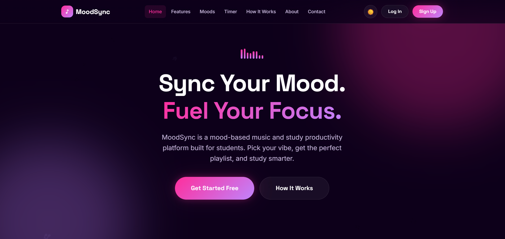
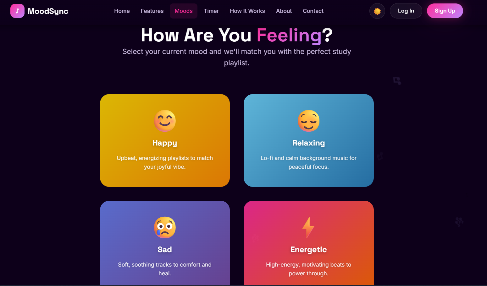
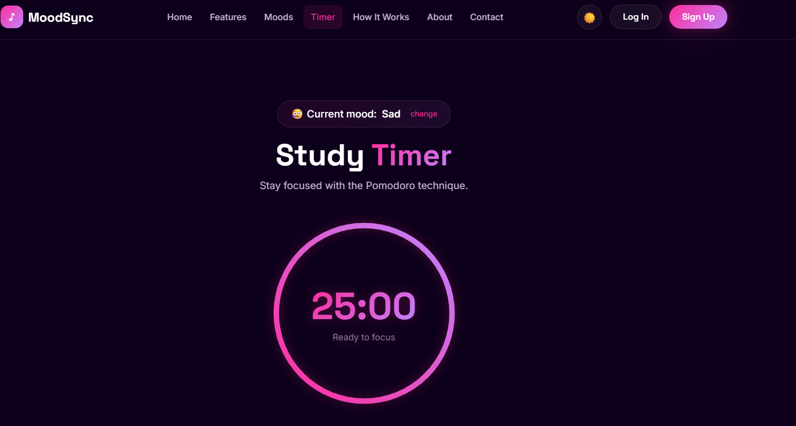
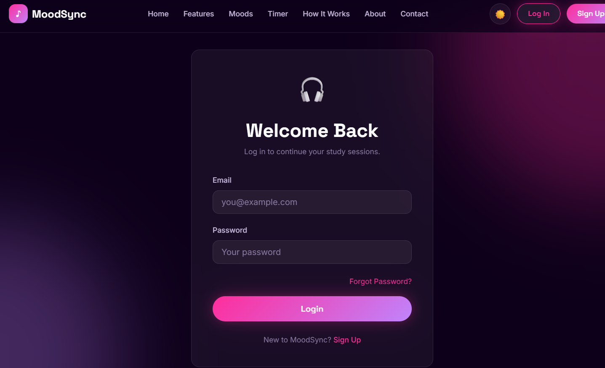

# MoodSync
Mood-based Music and Study Productivity Website

MoodSync is a web application designed to help students create a focused and productive study environment. The platform combines mood-based music recommendations with a built-in study timer, allowing users to stay motivated and manage their study sessions efficiently.

The idea behind MoodSync is that different moods influence concentration and productivity differently. By selecting a mood, users can access suitable Spotify playlists while using productivity tools to maintain focus.

## ✨ Features

* 🎭 Mood-based music selection
* 🎧 Spotify playlist integration
* ⏱️ Pomodoro study timer
* 🕒 Custom timer durations (15, 25, 50 minutes)
* 🌈 Dynamic mood-based themes
* 🌙 Light and Dark mode support
* 🔐 User authentication system
* 📱 Responsive and user-friendly interface

## 🛠️ Technologies Used

### Frontend

* HTML5
* CSS3
* JavaScript

### Backend

* Node.js

## 🚀 How It Works

1. User creates an account or logs in.
2. User selects a mood (Happy, Relaxing, Energetic, or Sad).
3. The application redirects to a suitable Spotify playlist.
4. User starts a study session using the built-in timer.
5. The interface adapts according to the selected mood.

---

## 📚 What I Learned

Through this project, I gained experience in:

* Frontend web development
* Responsive web design
* JavaScript DOM manipulation
* User authentication concepts
* Node.js fundamentals
* UI/UX design principles
* Team collaboration and project development

## 👥 Team Members

* Aditi Thakur
* Gursirat Kaur

## 🔮 Future Improvements

* Personalized playlist recommendations
* Study progress analytics
* User profile customization
* Advanced productivity tracking
* Mobile application support

---

## 📸 Screenshots

### 🏠 Home Page

### 🎭 Mood Selection

### ⏱️ Study Timer

### 🔐 Login Page

## 🎯 Project Goal

MoodSync was developed as a first-year B.Tech project to explore how music and productivity tools can be combined into a single platform that helps students focus better while studying.
